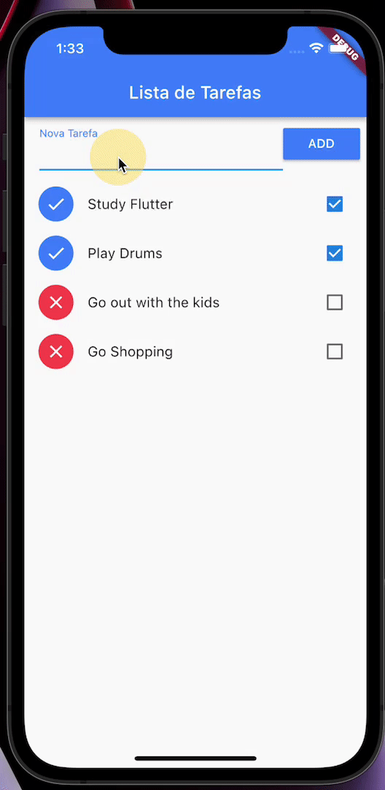

# Simple TODO List in Flutter

Simple TODO list in flutter , just to remember the basics of the framework.

- Data persistence with `path_provider`
- `ListView` with `Dismissible` Items to remove from list.

### Widgets

- Dismissible
- InputText
- Expanded
- RaisedButton
- RefreshIndicator
- ListView
- Icon
- Text
- Column
- Container
- Row

## Screenshots

## Getting Started

A few resources to get you started if this is your first Flutter project:

- [Lab: Write your first Flutter app](https://flutter.dev/docs/get-started/codelab)
- [Cookbook: Useful Flutter samples](https://flutter.dev/docs/cookbook)

For help getting started with Flutter, view our
[online documentation](https://flutter.dev/docs), which offers tutorials,
samples, guidance on mobile development, and a full API reference.
